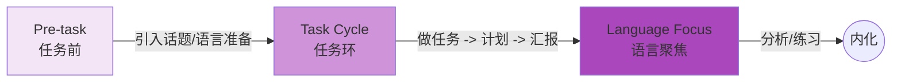

# 顶尖教案标准参考文档 (Top-tier Lesson Plan Standards Reference)

本文档旨在为教育工作者和 AI 提示词工程师提供高质量教案的编写标准、模板参考及评估体系。

## 1. 国际标准教案模板 (International Standard Templates)

### 1.1 CELTA 教案模板 (Cambridge)
CELTA (Certificate in Teaching English to Speakers of Other Languages) 是全球公认的英语教学黄金标准，其教案强调**逻辑性**、**预判性**和**以学生为中心**。

*   **核心板块**:
    *   **General Information**: 班级概况、时长、教材。
    *   **Teaching Aims (教学目标)**:
        *   *Main Aim*: 本节课最核心的语言点或技能。
        *   *Subsidiary Aims*: 辅助性目标（如复习相关词汇）。
        *   *Personal Aims*: 教师个人的教学改进目标（如减少 TTT - Teacher Talking Time）。
    *   **Language Analysis (语言分析)**:
        *   *Meaning*: 概念检查问题 (CCQs)。
        *   *Form*: 词性、时态结构。
        *   *Pronunciation*: 音标、重音、语调。
    *   **Anticipated Problems & Solutions (预判问题与解决方案)**:
        *   针对语言内容 (Language related)。
        *   针对课堂管理 (Classroom management related)。
    *   **Procedure (详细流程)**:
        *   Time (时间)
        *   Stage (阶段)
        *   Aim (阶段目标)
        *   Procedure (具体步骤)
        *   Interaction (互动模式: T-S, S-S, S, Group)

### 1.2 TEFL/TESOL 通用认证标准
强调实用性和 **SWBAT** (Students Will Be Able To) 目标的达成。

*   **结构**:
    1.  **Warm-up (热身)**: 激活旧知，引入话题。
    2.  **Introduction (导入)**: 明确本课目标 (Objective)。
    3.  **Presentation (呈现)**: "I do" - 教师演示新内容。
    4.  **Practice (练习)**: "We do" - 师生共同练习 (Guided Practice)。
    5.  **Production (产出)**: "You do" - 学生独立应用 (Independent Practice)。
    6.  **Review/Assessment (复习/评估)**: 检查目标达成情况。

### 1.3 国际学校 (IB/Common Core) 格式
注重**探究式学习 (Inquiry-based)** 和 **差异化教学 (Differentiation)**。

*   **关键要素**:
    *   **Unit of Inquiry (探究单元)**: 与大概念 (Big Idea) 的联系。
    *   **Differentiation (差异化)**:
        *   *Support*: 为基础薄弱学生提供的支架。
        *   *Extension*: 为能力较强学生提供的挑战。
    *   **Cross-curricular Links (跨学科联系)**: 与科学、艺术等学科的结合。
    *   **Reflection (反思)**: 课后教师反思。

### 1.4 中国新课标教案要求 (New Curriculum Standards)
强调 **核心素养 (Core Competencies)** 和 **英语学习活动观 (Activity-based Approach)**。

*   **核心要素**:
    *   **教学分析**: 语篇分析 (What/Why/How)、学情分析。
    *   **教学目标**: 语言能力、文化意识、思维品质、学习能力。
    *   **教学重难点**: Key Points & Difficult Points.
    *   **教学过程**:
        *   *学习理解类活动*: 感知与注意、获取与梳理、概括与整合。
        *   *应用实践类活动*: 描述与阐释、分析与判断、内化与运用。
        *   *迁移创新类活动*: 推理与论证、批判与评价、想象与创造。

---

## 2. 教案质量标准 (Quality Standards)

### 2.1 完整性检查清单 (Checklist)
一个一流的教案必须包含以下要素：

- [ ] **SMART 目标**: Specific (具体), Measurable (可衡量), Achievable (可达成), Relevant (相关), Time-bound (有时限)。
- [ ] **逻辑流**: 环节之间过渡自然，难度呈螺旋上升。
- [ ] **以学生为中心**: 学生练习时间 (STT) > 教师讲解时间 (TTT)。
- [ ] **互动多样性**: 包含 T-S (师生), S-S (生生), Pair work (同伴), Group work (小组)。
- [ ] **预判与对策**: 提前想好学生可能犯的错误及应对方法。
- [ ] **检查机制**: 包含 CCQs (概念检查问题) 或 ICQs (指令检查问题)。

### 2.2 教学法标准流程 (Standard Flows)

#### PPP (Presentation-Practice-Production)
*适用于语法、词汇等准确性要求高的内容。*


#### TBLT (Task-Based Language Teaching)
*适用于培养流利度和解决问题的能力。*


#### PWP (Pre-While-Post)
*适用于阅读 (Reading) 和听力 (Listening) 技能课。*


### 2.3 评分标准 (Rubric)

| 维度 | ⭐⭐⭐⭐⭐ (卓越) | ⭐⭐⭐ (合格) | ⭐ (需改进) |
| :--- | :--- | :--- | :--- |
| **目标设定** | 清晰、可衡量，贯穿全课 | 目标存在但略显笼统 | 目标缺失或不可衡量 |
| **活动设计** | 创意十足，紧扣目标，层次分明 | 活动常规，能服务于教学 | 活动与目标脱节，枯燥 |
| **学生参与** | 极高的 STT，全员积极互动 | 只有部分学生参与 | 教师“一言堂” (Lecture mode) |
| **预判能力** | 精准预判难点并有巧妙对策 | 仅提及可能的困难 | 无任何预判 |
| **时间管理** | 节奏把控完美，弹性调整 | 基本按时完成 | 严重拖堂或内容过少 |

---

## 3. AI 集成师参考 (Reference for AI Integrators)

为了让 AI (如 Gemini, GPT-4) 生成符合上述标准的教案，请参考以下指南。

### 3.1 提示词模板 (Prompt Template)

```markdown
# Role
You are an expert ESL teacher trainer with CELTA and DELTA certifications.

# Task
Create a detailed lesson plan based on the following constraints.

# Inputs
- **Topic**: {{topic}}
- **Grade/Level**: {{grade}} (CEFR Level: {{level}})
- **Duration**: {{duration}} minutes
- **Methodology**: {{method}} (e.g., PPP, TBLT, PWP)

# Requirements
1. **Objectives**: Use SWBAT format.
2. **Procedure**:
   - Provide time allocation for each stage.
   - Specify Interaction patterns (T-S, S-S, etc.).
   - Include specific "Teacher's Talk" (instructions) and anticipated "Students' Output".
3. **Differentiation**: Include 1 suggestion for struggling learners.
4. **Key Elements**:
   - For vocabulary, provide CCQs (Concept Checking Questions).
   - For grammar, provide a timeline or context description.

# Output Format
JSON format compatible with the application's schema:
{
  "title": "...",
  "teachingPreparation": { ... },
  "procedures": [
    { "step": "...", "duration": 5, "interaction": "T-S", "teachersTalk": "...", "studentsOutput": "...", "justification": "..." }
  ]
}
```

### 3.2 优秀教案示例 (Best Practice Example)

*场景：Grade 3, Topic: "My Family", Method: TBLT*

**教学准备 (Preparation)**:
*   **Objectives**: By the end of the lesson, students will be able to introduce family members using "This is my..." and describe them using 2-3 adjectives.
*   **Aids**: Family photos, drawing paper.

**过程片段 (Procedure Snippet)**:

*   **Stage**: Task Cycle (Report)
*   **Time**: 10 min
*   **Interaction**: Group -> Class
*   **Teacher Activity**: "Who wants to share their family tree? Listen and tell me: How many people are in their family?" (Task-based listening)
*   **Student Activity**: Students present their drawings. Others listen and answer the checking question.
*   **Justification**: Provides a communicative purpose for listening; validates student work.

### 3.3 常见问题及解决方案 (FAQ)

*   **Q: AI 生成的活动不够具体，只有“做练习”。**
    *   *Fix*: 在 Prompt 中强制要求“Provide specific examples of questions or sentences used in the activity”。
*   **Q: 时间分配不合理（如热身占了 20 分钟）。**
    *   *Fix*: 在 System Prompt 中设定规则，如“Warm-up must not exceed 10% of total duration”。
*   **Q: 缺乏互动，变成了讲座。**
    *   *Fix*: 强制要求每一阶段注明 `Interaction Pattern`，并惩罚连续的 `T-S` 模式。
