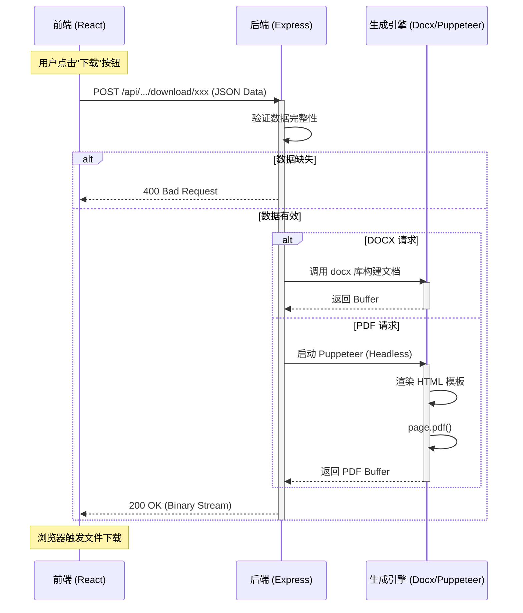

# 用户与 API 指南 (User & API Guide)

本指南涵盖了教学方法说明、功能使用说明以及开发者 API 文档。

## 1. TTT 教学法说明 (Test-Teach-Test)

**TTT (Test-Teach-Test)** 是一种以学生为中心的教学模式，特别强调根据学生的实际需求进行针对性教学。

- **教学方法**：Test-Teach-Test (测试-教学-测试)
- **适用场景**：
  - 语法点教学 (Grammar Points)
  - 技能训练 (Skill Training)
  - 复习课或诊断性课程

### 流程说明

1.  **测试 (Test 1)**：
    - **目的**：初始测试，了解学生现有水平和知识缺口 (Gap)。
    - **活动**：不仅限于试卷，可以是角色扮演、看图说话等任务。
    - **作用**：教师观察并记录学生的问题，不立即纠正。
2.  **教学 (Teach)**：
    - **目的**：针对性教学，解决测试中发现的具体问题。
    - **活动**：讲解规则、纠正错误、示范正确用法。
    - **作用**：填补知识缺口，避免重复讲解学生已掌握的内容。
3.  **测试 (Test 2)**：
    - **目的**：最终测试，检验学习效果和新知运用能力。
    - **活动**：类似 Test 1 的任务，但要求正确使用新学内容。
    - **作用**：巩固强化，建立自信。

### 流程可视化

```mermaid
graph LR
    A[测试 1 (Test 1)] -->|发现缺口| B[教学 (Teach)]
    B -->|针对性讲解| C[测试 2 (Test 2)]
    C -->|巩固运用| D((完成学习))
    
    subgraph "诊断阶段"
    A
    end
    
    subgraph "干预阶段"
    B
    end
    
    subgraph "验证阶段"
    C
    end
    
    style A fill:#f9f,stroke:#333,stroke-width:2px
    style B fill:#bbf,stroke:#333,stroke-width:2px
    style C fill:#bfb,stroke:#333,stroke-width:2px
```

---

## 2. 下载功能使用说明

本工具提供两种格式的教案下载，满足不同场景需求。

### Word 版本 (.docx)
- **特点**：完全可编辑。
- **适用场景**：
  - 需要对 AI 生成的内容进行二次修改或补充。
  - 需要调整排版以符合学校特定模板。
  - 打印纸质教案。
- **内容包含**：完整的教学目标、准备工作、详细步骤表格。

### PDF 版本 (.pdf)
- **特点**：格式固定，跨设备浏览一致。
- **适用场景**：
  - 快速分享给同事或管理层查阅。
  - 存档记录，防止格式错乱。
  - 在移动设备上查看。
- **内容包含**：精美的排版样式，包含所有教案细节。

---

## 3. API 文档

本节面向开发者，描述了教案下载服务的接口细节。

### 基础信息
- **Base URL**: `http://localhost:3000` (开发环境)
- **Content-Type**: `application/json`

### 接口概览

| 功能 | 方法 | 路径 | 描述 |
| --- | --- | --- | --- |
| 下载 Word | POST | `/api/lesson-plans/:id/download/docx` | 生成并下载 Word 文档 |
| 下载 PDF | POST | `/api/lesson-plans/:id/download/pdf` | 生成并下载 PDF 文档 |

### 接口详情

#### 1. 下载 Word 文档

将前端生成的 JSON 教案转换为 Word 文件流。

- **URL**: `/api/lesson-plans/:id/download/docx`
- **Method**: `POST`
- **URL Params**: 
  - `id`: (可选) 教案 ID，目前主要用于日志记录，实际内容由 Body 决定。

- **Request Body**: `LessonPlan` 对象

```json
{
  "title": "一般过去时",
  "grade": "Grade 3",
  "duration": 45,
  "teachingPreparation": {
    "objectives": ["掌握动词过去式", "能描述昨天发生的事"],
    "keyWords": ["went", "played", "saw"]
  },
  "procedures": [
    {
      "step": "热身",
      "duration": 5,
      "teachersTalk": "询问昨天做了什么",
      "studentsOutput": "回答问题"
    }
  ]
}
```

- **Success Response**:
  - **Code**: 200 OK
  - **Content-Type**: `application/vnd.openxmlformats-officedocument.wordprocessingml.document`
  - **Header**: `Content-Disposition: attachment; filename=lesson-plan.docx`
  - **Body**: Binary File Stream

- **Error Response**:
  - **Code**: 400 Bad Request
    - **Content**: `{ "error": "Missing lesson plan data" }`
  - **Code**: 500 Internal Server Error
    - **Content**: `{ "error": "Failed to generate DOCX" }`

#### 2. 下载 PDF 文档

利用服务端 Puppeteer 渲染 HTML 并生成 PDF。

- **URL**: `/api/lesson-plans/:id/download/pdf`
- **Method**: `POST`
- **Request Body**: 同 Word 接口，接收 `LessonPlan` 对象。

- **Success Response**:
  - **Code**: 200 OK
  - **Content-Type**: `application/pdf`
  - **Header**: `Content-Disposition: attachment; filename=lesson-plan.pdf`
  - **Body**: Binary File Stream

- **Error Response**:
  - **Code**: 500 Internal Server Error
    - **Content**: `{ "error": "Failed to generate PDF" }`

### 下载流程时序图

以下展示了客户端发起下载请求后的处理流程：


